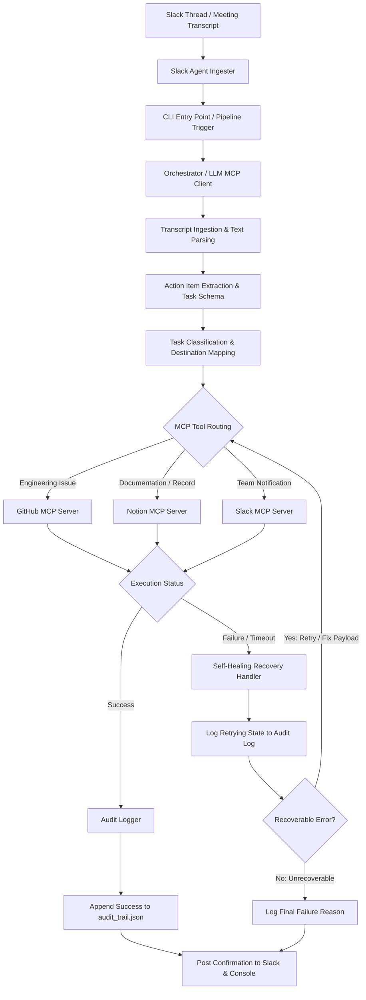
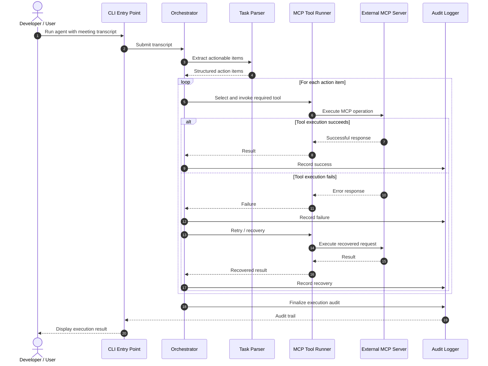
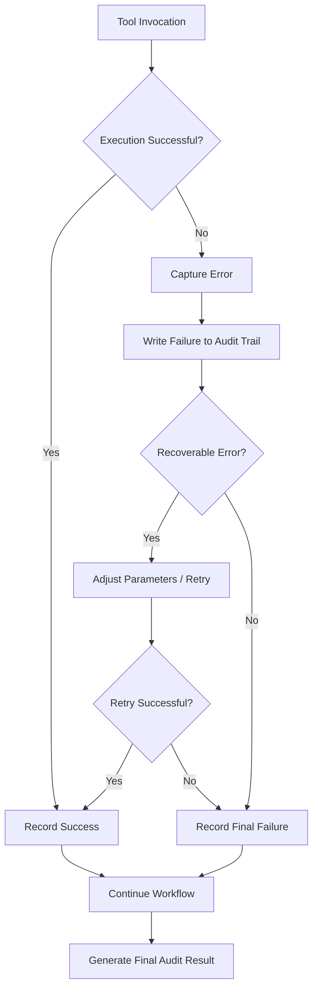

# Autonomous Meeting Action Item Agent

> **AI Engineer Intern — Buildathon Submission**

An AI-powered meeting follow-up agent that converts unstructured meeting notes into actionable tasks and executes those tasks through **Model Context Protocol (MCP)** tools, with structured logging and failure recovery.

---
## 1. Overview

Meetings often produce important action items, but these items are frequently lost across meeting notes, Slack messages, documents, and task trackers.

This project explores an autonomous workflow that:

1. Accepts a raw meeting transcript.
2. Identifies actionable items from the transcript.
3. Determines the required action and destination.
4. Uses MCP tools to interact with external systems.
5. Handles tool/API failures through controlled retries and recovery.
6. Maintains an audit trail of the complete execution.
7. Produces a traceable result that can be inspected after execution.

The implementation is designed as a **CLI-first workflow**, making the core agent easy to execute, test, and demonstrate without requiring a web server.

---

# 2. Capability Selected

## Model Context Protocol (MCP) Integration

The primary capability explored in this buildathon is **Model Context Protocol (MCP)**.

MCP provides a standardized interface through which an AI agent can discover and invoke tools exposed by external services.

In this project, MCP acts as the execution layer between the agent's reasoning and external systems such as:

* GitHub
* Notion
* Slack
* Other MCP-compatible services

The important design principle is that the LLM does not directly implement every API integration. Instead, the agent interacts with capabilities exposed through MCP tools.

---

# 3. Problem Statement

For small and medium-sized organizations, meeting outcomes are often manually converted into:

* GitHub issues
* Engineering tasks
* Notion records
* Slack follow-ups
* Internal reminders

This creates several problems:

* Action items can be forgotten.
* Responsibility can be unclear.
* Follow-up work requires manual effort.
* API operations can fail.
* There is often no clear audit trail explaining what happened.

### Proposed Solution

Build an autonomous meeting-action workflow that transforms:

```text
Meeting Transcript
       ↓
Action Item Extraction
       ↓
Task Classification
       ↓
MCP Tool Selection
       ↓
External Action
       ↓
Validation
       ↓
Audit Trail
```

---

# 4. Target ICP

### Ideal Customer Profile

**50–300 person technology or service-oriented companies**

These organizations typically have enough operational complexity for meeting follow-up to become a problem, while still relying heavily on lightweight tools such as:

* Slack
* GitHub
* Notion
* Google Workspace
* Project management platforms

### Business Pain

The core pain point is:

> **Post-meeting execution drag**

Important decisions and action items are generated during meetings, but converting those decisions into actual system updates is still largely manual.

---

# 5. Core Workflow

The agent accepts a meeting transcript such as:

```text
Today's engineering meeting:

Nithesh will refactor the database connector by Friday.

Yakshith will configure Grafana Loki log drop rules.

The team also agreed that the telemetry documentation should be
updated before the next review.
```

The agent identifies actionable tasks and maps them to available tools.

Example:

| Meeting Action                 | Destination   | Operation    |
| ------------------------------ | ------------- | ------------ |
| Refactor database connector    | GitHub        | Create issue |
| Configure Loki log rules       | GitHub        | Create issue |
| Update telemetry documentation | Notion/GitHub | Create task  |

---

# 6. System Architecture



---

# 7. Execution Sequence



---

# 8. Self-Healing Design

External tool execution is inherently unreliable.

Possible failures include:

* Invalid parameters
* Authentication failures
* Rate limits
* Temporary network failures
* Incorrect tool input
* Unexpected API responses
* MCP server errors

Instead of treating a single tool failure as the end of the workflow, the system maintains an execution state and records failures.

### Recovery Flow



The goal is not to hide failures.

The goal is to make failures:

* visible
* structured
* recoverable where possible
* traceable when recovery is unsuccessful

---

# 9. Audit Trail

Every important execution event should be recorded.

Example:

```json
{
  "timestamp": "2026-09-15T10:30:00Z",
  "action": "create_github_issue",
  "status": "success",
  "task": "Refactor database connector",
  "tool": "github_mcp",
  "result": {
    "issue_number": 42
  }
}
```

For a failure:

```json
{
  "timestamp": "2026-09-15T10:31:12Z",
  "action": "create_github_issue",
  "status": "failed",
  "tool": "github_mcp",
  "error": "API request failed",
  "retry_attempt": 1
}
```

This provides an execution history rather than only returning the final result.

---

# 10. Repository Structure

```text
AI_Agent/
│
├── buildthon_workflow/
│   │
│   ├── sample_meeting_notes.txt
│   ├── run_agent.ts
│   │
│   └── outputs/
│       └── audit_trail.json
│
├── et_agent_v1/
│   │
│   ├── fastmcp/
│   │   └── ...
│   │
│   └── Slack-ClawdBot-main/
│       │
│       ├── src/
│       │   ├── agents/
│       │   ├── mcp/
│       │   ├── utils/
│       │   │   └── logger.ts
│       │   └── index.ts
│       │
│       └── package.json
│
├── docs/
│   ├── vscode_screenshot.png
│   ├── terminal_execution.png
│   ├── github_issue.png
│   └── workflow_execution.gif
│
└── README.md
```

---

# 11. CLI Execution

The buildathon workflow intentionally uses a CLI entry point rather than introducing another web server.

The execution path is:

```text
sample_meeting_notes.txt
            ↓
       run_agent.ts
            ↓
       Orchestrator
            ↓
       MCP Tool Calls
            ↓
     External Services
            ↓
      Audit Logger
            ↓
     audit_trail.json
```

---

# 12. Example CLI Entry Point

```typescript
import { Orchestrator } from "../et_agent_v1/Slack-ClawdBot-main/src/agents/orchestrator";
import * as fs from "fs";
import * as path from "path";

async function main() {
  const transcriptPath = path.join(
    __dirname,
    "sample_meeting_notes.txt"
  );

  const transcript = fs.readFileSync(transcriptPath, "utf-8");

  console.log(
    "\n[Buildathon Agent] Processing Meeting Transcript...\n"
  );

  const orchestrator = new Orchestrator();

  const auditLog =
    await orchestrator.processMeetingTranscript(transcript);

  console.log(
    "\n[Buildathon Agent] Execution Complete\n"
  );

  console.dir(auditLog, {
    depth: null
  });
}

main().catch((error) => {
  console.error("[Buildathon Agent] Pipeline Error:", error);
  process.exit(1);
});
```

---

# 13. Environment Configuration

Create a `.env` file containing the required credentials.

```env
OPENAI_API_KEY=your_openai_api_key
GITHUB_PERSONAL_ACCESS_TOKEN=your_github_token
NOTION_API_KEY=your_notion_token
SLACK_BOT_TOKEN=your_slack_token
```

> Never commit real credentials or `.env` files to the repository.

Add:

```text
.env
```

to `.gitignore`.

---

# 14. Running the Project

### Step 1 — Clone the repository

```bash
git clone <repository-url>
cd AI_Agent
```

### Step 2 — Navigate to the buildathon workflow

```bash
cd buildthon_workflow
```

### Step 3 — Add meeting notes

Edit:

```text
sample_meeting_notes.txt
```

Example:

```text
Nithesh will refactor the database connector by Friday.

Yakshith will configure Grafana Loki log drop rules.

The telemetry documentation should be updated before the next review.
```

### Step 4 — Run the agent

```bash
npx ts-node run_agent.ts
```

### Step 5 — Inspect the output

The execution result is printed to the terminal and the structured audit trail is stored under:

```text
buildthon_workflow/outputs/
```

---

# 15. Design Decisions

## CLI-first execution

A CLI was chosen for the buildathon because it:

* minimizes infrastructure requirements
* makes the workflow reproducible
* simplifies debugging
* keeps the demonstration focused on the agent
* avoids unnecessary web-server complexity

---

## MCP for tool execution

Rather than tightly coupling the orchestrator to every external API, MCP provides a standardized tool interface.

This makes it easier to add or replace capabilities without significantly changing the agent architecture.

---

## Structured audit logging

The system records execution events instead of only returning a final success/failure state.

This makes the workflow easier to:

* debug
* evaluate
* monitor
* reproduce
* extend into production

---

## Controlled recovery

Failures are explicitly classified and logged before recovery is attempted.

The objective is:

```text
Failure
   ↓
Understand Failure
   ↓
Recover if Possible
   ↓
Record Result
```

rather than blindly retrying every request.

---

# 16. Failure Scenarios

| Scenario                 | Expected Behaviour                                              |
| ------------------------ | --------------------------------------------------------------- |
| Invalid tool parameters  | Log error and attempt parameter correction                      |
| Temporary API failure    | Retry according to recovery policy                              |
| Rate limiting            | Record failure and retry with controlled delay                  |
| Authentication failure   | Stop unsafe retries and report configuration issue              |
| MCP server unavailable   | Record failure and continue/terminate based on task criticality |
| Successful tool call     | Record result and continue                                      |
| Partial workflow failure | Preserve completed actions and report failed actions            |

---

# 17. Extensibility

The architecture is designed so additional capabilities can be added without redesigning the complete workflow.

Potential future MCP integrations include:

```text
                ┌── GitHub
                │
                ├── Notion
                │
Agent ── MCP ───┼── Slack
                │
                ├── Google Calendar
                │
                ├── Jira
                │
                └── Linear
```

This allows the same meeting-processing workflow to support different organizational systems.

---

# 18. Alternative Capability-to-Pain-Point Pairings

During the design process, other MCP-based workflows were considered.

### 18.1 Inbound Lead Auto-Triage

```text
Lead Submission
      ↓
MCP Tool
      ↓
Lead Enrichment
      ↓
Classification
      ↓
Sales Assignment
```

The main benefit would be reducing manual sales triage.

---

### 18.2 Executive Morning Briefing

```text
Email + Calendar
       ↓
MCP Integration
       ↓
Priority Extraction
       ↓
Meeting Summary
       ↓
Morning Brief
```

The objective would be to provide executives with a concise daily operational summary.

---

### 18.3 Selected Approach

The meeting action-item workflow was selected because it combines:

* LLM reasoning
* MCP integration
* external tool execution
* structured outputs
* failure handling
* auditability

while remaining small enough to demonstrate within the buildathon timeline.

---

# 19. Evaluation Focus

The implementation is intentionally evaluated beyond simply asking:

> "Did the LLM generate the correct answer?"

The important evaluation dimensions are:

| Area                 | Evaluation                                          |
| -------------------- | --------------------------------------------------- |
| Task Extraction      | Were actionable items identified correctly?         |
| Tool Selection       | Was the appropriate MCP tool selected?              |
| Execution            | Was the external action successfully performed?     |
| Reliability          | How does the workflow behave when tools fail?       |
| Recovery             | Can recoverable failures be handled?                |
| Auditability         | Can each action be traced?                          |
| Extensibility        | Can additional MCP tools be integrated?             |
| Developer Experience | Can the workflow be easily executed and understood? |

---

# 20. Evidence

Execution evidence is maintained under:

```text
docs/
```

Recommended evidence:

### Codebase

Screenshot showing:

```text
buildthon_workflow/
et_agent_v1/
docs/
README.md
```

### CLI Execution

Show:

```text
Transcript
    ↓
Action extraction
    ↓
MCP execution
    ↓
Success / failure handling
    ↓
Audit trail
```

### External Result

Show the resulting:

* GitHub issue
* Notion record
* Slack message

depending on the configured workflow.

### Failure Recovery

Where possible, demonstrate a controlled tool failure and show:

```text
Tool Failure
     ↓
Logged
     ↓
Recovery Attempt
     ↓
Successful Retry
     ↓
Final Audit Entry
```

---

# 21. Current Scope

The buildathon implementation focuses on demonstrating the core autonomous workflow rather than building a complete production platform.

### Included

* Meeting transcript ingestion
* Action-item processing
* MCP-based tool execution
* Structured execution logging
* Failure detection
* Recovery mechanism
* CLI execution
* Architecture documentation

### Outside Current Scope

* Multi-tenant authentication
* Production-grade distributed deployment
* Advanced user interface
* Enterprise access control
* Large-scale workflow scheduling
* Comprehensive observability infrastructure

These can be added as the system evolves toward production.

---

# 22. Future Improvements

Potential production improvements include:

1. Persistent workflow state.
2. Idempotent tool execution.
3. More sophisticated retry policies.
4. Human approval for high-impact actions.
5. MCP server health monitoring.
6. Distributed task execution.
7. Persistent audit storage.
8. Role-based authorization.
9. Evaluation datasets for meeting transcripts.
10. Metrics for extraction accuracy and tool success rate.

A particularly important production improvement would be **human-in-the-loop approval** for destructive or high-impact operations.

---

# 23. Engineering Principle

The central design principle of this project is:

> **An autonomous agent should not only be capable of taking action; it should also be able to explain, trace, and recover from the actions it takes.**

The workflow therefore treats:

```text
Reasoning
   +
Tool Execution
   +
Failure Handling
   +
Auditability
```

as equally important parts of an AI engineering system.

---

# 24. Conclusion

This project demonstrates a practical approach to building an MCP-enabled autonomous agent for meeting follow-up automation.

The system takes unstructured meeting information and turns it into executable actions while maintaining an audit trail and handling failures through controlled recovery.

The implementation prioritizes:

* clear architecture
* reproducible execution
* modular MCP integration
* failure-aware workflows
* structured logging
* extensibility

The result is a lightweight foundation that can evolve from a buildathon prototype into a more robust autonomous workflow system.
